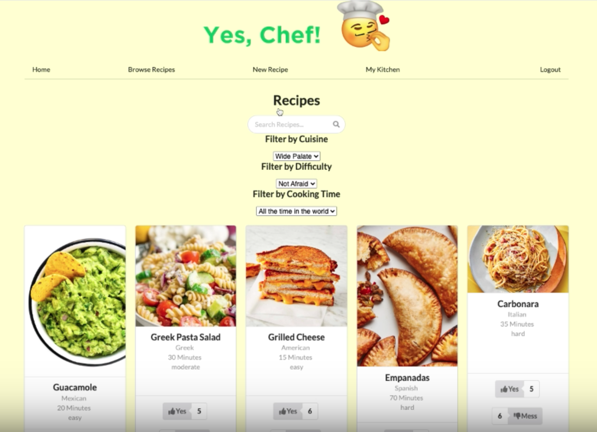

# YesChef
## About The Project

Full stack application that enables users to browse, search, and add recipes


 

### Loom video of YesChef
* https://www.loom.com/share/ff887918a7c44384894fdfd4be11ee49


<p align="right">(<a href="#readme-top">back to top</a>)</p>

## Built With
React |
Sinatra |
Semantic UI |
SQLite 


<p align="right">(<a href="#readme-top">back to top</a>)</p>


## Getting Started

Clone the repo
   ```sh
   git clone https://github.com/github_username/repo_name.git
   ```

## Docker 

If you have Docker installed, you can run this application with a single command: 
If you don't have docker, continue to backend and frontend setup. 

```console
$ docker compose up --build 
```
Run database migrations and seed data. You only need to do this once when setting up the application. 

```console
$  docker-compose run backend rake db:create db:migrate db:seed
```


### Backend Setup 

Cd into the backend, install the dependencies, migrate and seed your file, then start the server 

```console
$ cd backend 
$ bundle install 
$ rake db:migrate 
$ rake db:seed
$ bundle exec rake server
```
### Frontend Setup

Cd into the frontend, install the dependencies, and run the frontend server. 

```console
$ cd frontend 
$ npm install 
$ npm start
```

### Use default login to see features of this application 

* Email: liza123@liza.com

* Password: liza123


## Authors 

* Wendy Yeung: https://github.com/wendy174
* Liza McLain: https://github.com/lizareed5
* Michael Plisco: https://github.com/mplisco


## Contributing

Contributions are what make the open source community such an amazing place to learn, inspire, and create. Any contributions you make are **greatly appreciated**.

If you have a suggestion that would make this better, please fork the repo and create a pull request. You can also simply open an issue with the tag "enhancement".
Don't forget to give the project a star! Thanks again!

1. Fork the Project
2. Create your Feature Branch (`git checkout -b feature/AmazingFeature`)
3. Commit your Changes (`git commit -m 'Add some AmazingFeature'`)
4. Push to the Branch (`git push origin feature/AmazingFeature`)
5. Open a Pull Request

<p align="right">(<a href="#readme-top">back to top</a>)</p>


